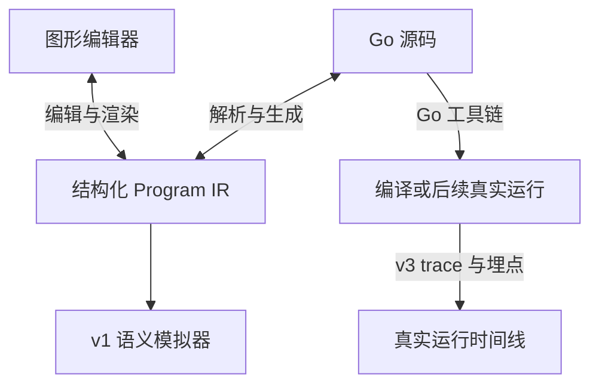

# Go 并发可视化编程环境：设计与实现规格

版本：0.1  
日期：2026-09-22  
文档语言：中文；代码、接口和标识符使用英文  
适用对象：负责实现项目的 Codex 或开发者

> 本文描述最终产品方向，并规定第一轮编码的交付范围。默认只实现 **v0：Go 与可视化图的双向编辑闭环**。v1 的语义模拟、v2 的语言扩展、v3 的真实运行分析是后续阶段。第一轮必须完成可运行的 v0，不能仅提供界面原型、假数据或空接口。

## 1. 项目目标

构建一个面向 Go 并发程序的可视化编程环境。用户可以拖拽操作节点生成 Go，也可以导入受支持的 Go 程序生成结构图，并在两种表示之间往返编辑。

最终产品包含三个彼此关联的能力：

1. **结构编辑**：查看和编辑函数、goroutine 创建、channel 创建、发送、接收和控制流程。
2. **语义模拟**：按步骤选择 goroutine 执行，观察消息、缓冲区、阻塞、唤醒和程序结束。
3. **真实运行分析**：运行 Go 程序，通过 trace 和埋点展示 goroutine、操作系统线程、调度资源及后续多进程活动。

程序结构、某种可能的执行过程和一次真实运行必须在数据模型及界面中明确区分。图形编程部分属于 Go 的可视化前端；机器码编译继续使用官方 Go 工具链。

### 1.1 第一轮成功标准

完成以下用户流程：

1. 导入示例程序，自动生成结构图。
2. 点击发送节点，将整数 `42` 改为 `100`。
3. 应用图形修改，得到实际生成的 Go 源码。
4. 使用真实 Go 工具链验证代码可以编译。
5. 导出 Go，重新导入后保留相同的程序结构、类型、绑定关系和操作顺序。
6. 从空项目通过添加、连接及排序节点，构建同样的程序。

```go
package main

import "fmt"

func main() {
    ch := make(chan int)

    go func() {
        ch <- 42
    }()

    value := <-ch
    fmt.Println(value)
}
```

本阶段的编译成功表示 Go 工具链接受程序，不表示程序一定不会阻塞或发生运行时错误。

## 2. 概念与产品边界

| 概念 | 定义 | 产品表示 |
| --- | --- | --- |
| Process | 操作系统进程，具有独立地址空间 | v0 默认为单个 Go 程序；v3 以后作为运行容器 |
| OS thread / M | 操作系统线程，可以执行 Go 代码、runtime 代码或系统调用 | 真实运行时间线中的资源轨道 |
| Goroutine / G | Go runtime 管理的并发执行单元 | 编辑时显示创建位置和函数体；运行时显示独立实例 |
| P | 执行用户 Go 代码所需的调度资源 | 后续调度视图中的资源；不能把 P 标成进程 |
| Channel | 同一进程内用于传递指定类型值的通信资源 | 编辑时显示创建位置、类型、容量及引用；运行时显示实例和缓冲区 |
| AST | Go 源码的抽象语法树 | 解析及生成层内部使用 |
| Program IR | 产品内部的结构化程序模型 | 图形编辑、代码转换和模拟的共同输入 |
| Runtime state | 一次模拟或执行的状态 | 与 Program IR 分开保存 |

Go runtime 可以将 goroutine 调度到不同操作系统线程上。结构编辑器不能将普通 goroutine 永久绑定到一个线程。`runtime.LockOSThread` 等特殊能力属于未来扩展。

一个静态 `go` 语句是一个创建位置，并不总是一个运行实例；未来加入循环或函数调用后，同一位置可能产生多个 goroutine。同理，channel 创建位置与运行时 channel 对象必须使用不同 ID。

普通 Go channel 不用于跨操作系统进程直接通信。未来进程视图应另建管道、socket 等 IPC 类型。

## 3. 分阶段范围

| 阶段 | 必须提供的能力 | 阶段边界 |
| --- | --- | --- |
| v0：双向编辑 | 受限 Go 导入、IR、图形编辑、Go 生成、类型诊断、编译验证、项目保存与恢复 | 不执行模拟或用户程序，不展示虚构运行结果 |
| v1：语义模拟 | step、run、reset、选择 goroutine、channel 状态、消息与等待事件、受限模型内的死锁判断 | 解释受支持的 IR，不复刻 Go runtime 的 G–M–P 调度 |
| v2：语言扩展 | 逐项加入 if、for、select、函数参数、channel 参数、WaitGroup、Mutex 和取消操作 | 每种新语法必须同步定义导入、IR、生成、模拟及测试 |
| v3：真实分析 | 真实 Go trace、应用埋点、源码关联、线程和 P 时间线；之后再做多进程 | 实际执行与 v1 模拟分别标识；运行服务与编辑服务分离 |

v0 默认采用本地开发工具形态：浏览器前端访问本地 Go 服务。无需用户账号、数据库、云部署或 AI API。

### 3.1 v0 语言子集

| 语法或能力 | v0 规则 |
| --- | --- |
| 文件与包 | 单个 `main.go`，`package main`，一个无参数无返回值的 `main` |
| import | 允许无别名的 `fmt` import；仅支持对实际标准库 `fmt.Println` 的单参数调用；生成时按使用情况添加 import |
| 并发创建 | `go func() { ... }()`，匿名函数无参数无返回值；允许嵌套，但不支持命名函数调用或递归 |
| channel 创建 | `name := make(chan int)` 或 `name := make(chan int, N)`；N 为非负整数字面量 |
| channel 引用 | 直接引用词法作用域内的 channel 变量；允许内部 goroutine 捕获外层 channel |
| channel 绑定 | 创建后不可重新赋值；不支持 channel 别名赋值、返回 channel、channel 容器或接口传递 |
| 发送 | `ch <- expr`，expr 为支持的 int 表达式 |
| 接收 | `<-ch`、`value := <-ch`、`value, ok := <-ch`；支持合法的 `_` 忽略绑定 |
| 关闭 | `close(ch)` |
| 局部变量 | 单变量短声明 `name := expr`；类型为 int 或 bool；v0 不支持后续重新赋值 |
| 表达式 | 十进制整数字面量、负整数字面量、布尔字面量、局部 int/bool 变量引用，以及可安全去除的括号 |
| 输出 | `fmt.Println(expr)`，一个 int 或 bool 参数；不支持将接收操作直接嵌在实参里 |
| 返回 | 无值 `return`，以及函数体末尾的自然返回 |
| 共享数据 | 子 goroutine 只允许捕获外层 channel；不支持捕获外层 int/bool、指针或共享可变内存 |
| 注释 | 导入时保留原始源码副本；规范化生成暂不保证注释或排版保留 |

未列出的 Go 特性默认不属于 v0。包括字符串、算术表达式、分支、循环、select、命名函数、参数、方法、结构体、泛型、defer、recover、goto、cgo、别名或点 import，以及编译指令、`//line` 位置指令和 build tags。

`var ch chan int` 的 nil channel 声明在 v1 加入，并配套语义测试。v0 应将合法的该类程序标为不支持，不得将 nil channel 错当作 `make(chan int)`。

容量上限默认设为 1024、节点上限默认设为 500，作为可配置的产品资源限制，不是 Go 语言本身的限制。整数值在 JSON 和前端中用十进制字符串保存；后端根据实际目标工具链检查 int 范围，避免 JavaScript Number 丢失精度。

### 3.2 未支持代码的处理

导入结果分为三种：

- `editable`：Go 语法、类型及 v0 子集检查均通过，返回可编辑 IR。
- `unsupported`：Go 程序合法，但含有未支持能力；保留源代码，显示具体位置和原因，禁止用不完整 IR 覆盖代码。
- `invalid`：语法、作用域或类型错误；保留源码草稿和诊断，不替换最近一次有效模型。

v0 不对部分不理解的函数或语句做“猜测转换”，也不把它们静默删除。可只读展示原始源码，但不承诺对此类程序进行图形回写或模拟。

## 4. 系统架构



核心边界：

1. **IR 是已应用程序的语义来源**。画布坐标、源码排版、运行数据均不是独立的第二份程序语义。
2. IR 使用有序语句块和结构化语句。图形视图是其投影，不能用任意连线图代替整个程序模型。
3. AST 用于对接 Go 语法；IR 用于表达产品允许编辑和模拟的语义。
4. v0 使用 `go/parser`、`go/ast`、`go/token`、`go/types` 和 `go/format`。无需自行编写 Go lexer/parser，也无需先引入 SSA。
5. 多文件和真实项目导入阶段再引入 `golang.org/x/tools/go/packages`；需要更复杂数据流分析时再评估 SSA。

### 4.1 推荐技术栈

| 部分 | 默认选择 | 原因 |
| --- | --- | --- |
| 前端 | React、TypeScript、Vite | 便于构建本地交互工具 |
| 图形画布 | React Flow，包名 `@xyflow/react` | 节点、端口、连线、拖拽、分组和选择 |
| 代码区域 | v0 使用原生 textarea；后续可替换为 Monaco | 先交付语义闭环，避免编辑器集成成为前置依赖 |
| 状态 | React 状态与 reducer | 用明确编辑命令更新模型，避免状态源重复 |
| 后端 | Go 标准库 `net/http`，JSON API | 与 Go 解析和工具链直接衔接 |
| 持久化 | 本地 JSON 项目文件；浏览器自动保存可选 | 无数据库即可恢复语义和布局 |
| 验证 | Go 单元测试、前端类型检查、少量关键交互测试 | 验证真实转换和交互行为 |

已有仓库的兼容技术选择优先。新项目采用以上默认方案；实际依赖版本在实现时依据可用环境确定并提交 lockfile，不在此指定未经验证的版本号。

## 5. Program IR

### 5.1 模型原则

- 每个语法节点、函数、语句块和变量符号有唯一 ID。
- 变量引用指向 `SymbolId`，不能只存变量名。
- `BlockIR.statements` 的数组顺序决定顺序执行关系。
- channel 的通信连接引用同一个 channel 符号；这些连接不定义发送和接收的全局先后顺序。
- goroutine 函数体与创建语句分开建模；v0 每个匿名函数恰好由其对应的一个 `spawn` 语句引用。
- 函数表可以平铺保存，但生成 Go 时必须按原词法位置内联匿名函数，不能擅自提升为包级函数。
- 作用域和变量可见性来自结构，不来自节点的视觉位置。

### 5.2 规范性 TypeScript 形状

以下形状规定 JSON 合同。Go 端使用对应结构体及带 `kind` 的联合类型解码，拒绝未知版本、未知 kind 和类型不匹配字段。

```typescript
type NodeId = string;
type FunctionId = string;
type SymbolId = string;
type ValueType = "int" | "bool" | "chan int";

interface ProgramIR {
  schemaVersion: "1.0";
  id: string;
  packageName: "main";
  entryFunctionId: FunctionId;
  functions: FunctionIR[];
  symbols: SymbolIR[];
}

interface FunctionIR {
  id: FunctionId;
  kind: "main" | "goroutine";
  parentFunctionId: FunctionId | null;
  body: BlockIR;
}

interface BlockIR {
  id: NodeId;
  statements: StatementIR[];
}

interface SymbolIR {
  id: SymbolId;
  name: string;
  type: ValueType;
  scopeId: NodeId; // 声明所在 BlockIR.id
}

type ExprIR =
  | { id: NodeId; kind: "int_literal"; value: string }
  | { id: NodeId; kind: "bool_literal"; value: boolean }
  | { id: NodeId; kind: "variable"; symbolId: SymbolId };

type StatementIR =
  | {
      id: NodeId;
      kind: "make_channel";
      symbolId: SymbolId;
      capacity: number;
    }
  | {
      id: NodeId;
      kind: "let";
      symbolId: SymbolId;
      value: ExprIR;
    }
  | { id: NodeId; kind: "spawn"; functionId: FunctionId }
  | {
      id: NodeId;
      kind: "send";
      channelSymbolId: SymbolId;
      value: ExprIR;
    }
  | {
      id: NodeId;
      kind: "receive";
      channelSymbolId: SymbolId;
      bindings: (SymbolId | null)[];
    }
  | { id: NodeId; kind: "close"; channelSymbolId: SymbolId }
  | { id: NodeId; kind: "print"; value: ExprIR }
  | { id: NodeId; kind: "return" };
```

`receive.bindings` 的规则：

| 数组 | 生成代码 | 绑定类型 |
| --- | --- | --- |
| `[]` | `<-ch` | 无 |
| `["sym_value"]` | `value := <-ch` | int |
| `["sym_value", "sym_ok"]` | `value, ok := <-ch` | int、bool |
| `[null, "sym_ok"]` | `_, ok := <-ch` | bool |
| `["sym_value", null]` | `value, _ := <-ch` | int |

长度只能为 0、1、2；非空数组至少包含一个新声明的非空符号。非空绑定均为所在语句块中的新声明，v0 不支持向已有变量接收赋值。

容量省略与显式 `0` 规范化为同一个 `capacity: 0`。生成器统一省略零容量参数。字面量统一规范化为十进制表示。

### 5.3 最小示例 IR

以下完整 JSON 对应第 1.1 节程序。它应作为导入器、生成器和界面共同使用的参考 fixture。

```json
{
  "schemaVersion": "1.0",
  "id": "program_demo",
  "packageName": "main",
  "entryFunctionId": "fn_main",
  "functions": [
    {
      "id": "fn_main",
      "kind": "main",
      "parentFunctionId": null,
      "body": {
        "id": "block_main",
        "statements": [
          {
            "id": "stmt_make",
            "kind": "make_channel",
            "symbolId": "sym_ch",
            "capacity": 0
          },
          {
            "id": "stmt_spawn",
            "kind": "spawn",
            "functionId": "fn_sender"
          },
          {
            "id": "stmt_receive",
            "kind": "receive",
            "channelSymbolId": "sym_ch",
            "bindings": ["sym_value"]
          },
          {
            "id": "stmt_print",
            "kind": "print",
            "value": {
              "id": "expr_print_value",
              "kind": "variable",
              "symbolId": "sym_value"
            }
          }
        ]
      }
    },
    {
      "id": "fn_sender",
      "kind": "goroutine",
      "parentFunctionId": "fn_main",
      "body": {
        "id": "block_sender",
        "statements": [
          {
            "id": "stmt_send",
            "kind": "send",
            "channelSymbolId": "sym_ch",
            "value": {
              "id": "expr_42",
              "kind": "int_literal",
              "value": "42"
            }
          }
        ]
      }
    }
  ],
  "symbols": [
    {
      "id": "sym_ch",
      "name": "ch",
      "type": "chan int",
      "scopeId": "block_main"
    },
    {
      "id": "sym_value",
      "name": "value",
      "type": "int",
      "scopeId": "block_main"
    }
  ]
}
```

### 5.4 必须检查的不变量

1. 所有 ID 唯一，所有引用存在，函数父子关系无环。
2. 入口函数唯一且为 main；每个 goroutine 函数由其词法父函数中的一个 spawn 引用。
3. 符号在合法作用域内声明，使用位置满足 Go 的可见性和声明规则；遮蔽后的同名变量仍具有不同 SymbolId。
4. channel 操作只能引用 `chan int`，发送值必须可赋给 int；接收的第二个变量为 bool。
5. 捕获限制、容量限制、字面量范围和子集规则均通过检查。
6. 不能产生重复声明、悬空引用或 Go 非法标识符。
7. 空间拖动不会改变语义；语句排序和跨容器移动必须经过显式语义命令。
8. 生成的 AST 再通过 `go/types` 检查，包括未使用的局部变量及 import。

新建节点的编辑草稿允许暂时不完整，但不完整草稿不能应用、编译或模拟。不要自动插入 `_ = variable` 来掩盖未使用变量错误。

## 6. 源码映射、布局与版本

### 6.1 Source map

源码映射不属于 IR 的语义字段。每次导入或生成返回独立的映射：

```typescript
interface SourceSpan {
  file: "main.go";
  startByte: number; // UTF-8，包含
  endByte: number;   // UTF-8，不包含
  startLine: number; // 从 1 开始
  startColumn: number; // 从 1 开始，以 UTF-8 byte 计
}

type SourceMap = Record<NodeId, SourceSpan>;
```

点击图形节点后，用映射定位源代码；从源码位置选择范围最小的匹配节点。前端必须将 UTF-8 byte offset 转为 textarea 使用的 UTF-16 offset，不能假设中文注释前后的索引相同。

`go/format` 会改变位置，不能直接把生成前 AST 的 Pos 当作输出文件位置。v0 推荐格式化后重新解析输出 AST，按可验证的结构遍历对应回 IR 节点并重建映射。

### 6.2 项目文件

项目导出格式为 `*.goviz.json`，包含：

- `fileFormatVersion`：项目文件格式版本。
- `programRevision`：语义修订号。
- `ir`：最近一次有效的 ProgramIR。
- `layout`：节点坐标、容器布局、展开状态和画布视口。
- `source`：与该 IR 对应的最近一次已应用源码。
- `sourceHash`：源码 UTF-8 bytes 的 SHA-256。
- `sourceMap`：与该源码 hash 对应的源码映射。
- 可选 `originalImportedSource`：原始导入源码副本，用于保留尚未支持回写的注释与排版。

项目文件默认保存已应用状态。存在未应用语义草稿时，界面需要让用户先应用或放弃，避免把草稿误称为已保存程序。纯布局修改可以直接保存。

加载项目时先验证版本、IR 不变量和布局引用，再重新导入其 source 并比较规范化 IR；源码与模型不一致时返回项目一致性错误，不静默选一侧覆盖另一侧。源码映射应重新验证或重建，不能仅相信文件中自带的 sourceHash。

直接导出 `.go` 不包含布局数据。需要恢复精确布局时使用项目文件。v0 可以把源码与布局放在一个项目 JSON 中，无需先实现多个 sidecar 文件的同步机制。

### 6.3 ID 和缓存失效

- 图形编辑期间，未删除节点的 ID 保持稳定。
- 从项目文件加载时保留 ID。
- 任意源码修改后的重新导入可以产生新 ID 并重新布局；v0 不承诺跨任意文本修改匹配旧节点。
- 语义修改增加 `programRevision`，使旧编译结果及未来模拟状态失效。
- 纯布局修改不增加语义版本。
- 异步响应携带 requestId 及请求对应版本或 sourceHash；丢弃已过期响应。

## 7. 导入与生成流程

### 7.1 Go → IR

1. 检查输入大小、固定文件名和可处理编码。
2. 使用 `parser.ParseFile` 解析，开启注释收集，保留原始源码。
3. 检查允许的包与依赖；v0 不尝试联网加载任意依赖。
4. 使用 `go/types` 做名称解析、类型检查和常量检查。
5. 检查 v0 子集，生成包含精确位置的 unsupported 诊断。
6. 根据类型检查得到的 Object 建立符号表，生成结构化 IR。
7. 验证 IR 不变量，返回 IR、源码映射和 sourceHash。

遇到不允许的依赖时可直接返回 unsupported；不能仅因为无法加载外部包就宣称源程序存在类型错误。识别 `make`、`close`、`fmt.Println` 时应检查实际绑定，不能只匹配标识符文本。

### 7.2 IR → Go

1. 校验 JSON、版本、引用、作用域及语义。
2. 构建 `ast.File`、main 函数和递归内联的匿名函数体。
3. 根据实际使用添加 `fmt` import。
4. 使用 `go/types` 校验生成 AST；返回可映射到节点的错误。
5. 使用 `go/format` 输出格式化 Go。
6. 重新解析并建立输出 SourceMap。
7. 返回代码和诊断；调用方确认响应未过期后才应用。

生成逻辑应是确定性的。不要用字符串正则替代 AST 解析，不要调用 LLM 猜测 Go 语义。辅助固定模板可用于初始化空项目，但正式生成必须依据用户实际 IR。

### 7.3 往返正确性

对受支持 IR，要求：

```text
Normalize(Import(Generate(ir))) == Normalize(ir)
```

Normalize 去除临时 ID、源码位置和布局，将函数及符号引用规范编号，并规范化零容量和整数字面量。它必须保留变量名、类型、作用域、引用绑定、函数词法嵌套、语句顺序、值和容量。

不得通过删除有意义字段让往返测试通过。编译通过也不能替代这一结构测试；一次运行输出相同同样不足以证明并发程序等价。

## 8. 图形编辑与交互

### 8.1 v0 界面

- 左侧：节点工具箱，包含 channel、goroutine、发送、接收、关闭、变量、打印和返回。
- 中部：main 与 goroutine 执行区域，每个区域包含有序操作；channel 显示为独立资源节点。
- 右侧：可切换的源码区域和选中节点属性。
- 下方：语法、类型、子集及编译诊断。
- 顶部：新建、打开示例、导入 Go、打开项目、应用修改、编译验证、导出 Go、保存项目。

编译结果来自真实后端。v0 不显示未实现的运行进度、线程时间线或假的执行动画。

### 8.2 三种边

| 边 | 含义 | v0 编辑规则 |
| --- | --- | --- |
| 顺序边 | 同一语句块中的先后关系 | 由 statements 顺序派生，通过插入或排序操作修改 |
| spawn 边 | 某条 go 语句创建并发执行 | 由 spawn 与函数引用派生 |
| channel 引用边 | 发送、接收、关闭操作引用 channel | 可通过端口连接改变引用，必须验证类型和词法可见性 |

使用线型、端口和标签区分，不只依赖颜色。一个 channel 可有多个发送与接收者；v0 不强制一对一连接，也不声称已确定具体消息的配对关系。

无缓冲 channel 的 UI 标签为 `unbuffered` 或“无缓冲”，不要绘制一个容量为 1 的队列冒充其语义。

### 8.3 语义命令

至少实现：

- AddStatement：向指定 Block 的指定位置添加操作。
- AddGoroutine：创建函数体和对应 spawn。
- UpdateLiteral：修改发送值或局部值。
- UpdateChannelCapacity：修改 channel 容量。
- BindChannel：将操作绑定到词法可见的 channel。
- RenameSymbol：修改一个 Symbol 的名称，所有引用保持相同 SymbolId。
- ReorderStatement：改变同一 Block 中的执行顺序。
- DeleteStatement / DeleteGoroutine：删除操作或子树。
- MoveVisualNode：仅改变坐标。

删除仍有引用的 channel 声明时拒绝应用并指出引用位置；不要静默删除相关发送和接收。v0 可暂不支持把已有操作拖到另一个函数作用域：可见性改变不能靠调整坐标完成。

channel 的资源节点是声明的一个视图，其创建语句仍有确定的执行位置。UI 应能通过选中资源定位创建操作，避免让用户误以为 channel 在程序开始前自动存在。

基本撤销/重做覆盖语义命令和布局命令，不需要协同编辑协议。

### 8.4 双向编辑状态

维护 `committedIR`、`committedSource`、`layout` 与 `activeDraft`。activeDraft 只能为 source、graph 或空；同一时刻只允许一侧存在未应用的语义草稿。

1. 编辑源码产生 source draft；“应用代码修改”成功后，更新 IR、源码映射和布局。
2. 编辑图形产生 graph draft；“应用图形修改”成功后，更新 IR 和生成的源码。
3. 在未应用草稿存在时切换语义编辑侧，提供保留当前草稿或明确放弃的选择。
4. 输入错误或不支持代码不替换 committedIR；如继续显示旧图，必须标注它属于最近一次有效版本。
5. 移动坐标不产生源码变更，属性面板修改值属于语义变更。
6. 第一次从导入代码应用图形修改时提示输出采用规范化格式，原始注释保存在源码副本中。

不做双方每次键入都相互覆盖的自动同步。后续可在 graph draft 旁提供只读实时生成预览。

## 9. 本地服务 API

HTTP 请求与响应使用 JSON。每个响应回显 `requestId`；IR 及项目文件版本必须显式检查。

### 9.1 v0 接口

| 接口 | 主要输入 | 主要输出 |
| --- | --- | --- |
| `GET /api/health` | 无 | 服务状态、Go 工具链是否可用及版本 |
| `POST /api/import` | requestId、source | status、ir、sourceMap、sourceHash、diagnostics |
| `POST /api/generate` | requestId、programRevision、ir | status、source、sourceMap、sourceHash、diagnostics |
| `POST /api/build` | requestId、programRevision、ir | status、工具链版本、耗时及可定位诊断 |

status 使用明确枚举：

- import：`editable`、`unsupported`、`invalid`。
- generate：`ok`、`invalid_ir`。
- build：`ok`、`compile_error`、`timeout`、`toolchain_unavailable`。

合法 API 请求内的程序诊断使用 HTTP 200 和上述 status；格式错误 JSON、过大请求、版本不支持及服务错误分别使用合适的 HTTP 错误码。禁止把后端失败渲染为成功。

统一诊断结构：

```typescript
interface Diagnostic {
  code: string;
  severity: "error" | "warning" | "info";
  phase: "parse" | "types" | "subset" | "ir" | "generate" | "build";
  message: string;
  nodeId?: NodeId;
  span?: SourceSpan;
}
```

应用源码属于前端状态操作，后端转换接口无需持久化整个项目。

### 9.2 编译验证

`/api/build` 接受 IR，后端重新校验并生成代码，在独立临时目录中调用本机 `go build`。接口不接受任意 shell 命令、文件路径或额外编译参数。

v0 仅使用 fmt 等明确支持的标准库依赖；工具链自动下载和远程依赖获取默认关闭。设置编译超时、合理输出大小上限，并清理临时产物。服务绑定 loopback，由本地前端代理请求。

如果 Go 不可用，返回真实的 `toolchain_unavailable` 并提供安装说明，不能用语法解析成功冒充编译成功。

## 10. v1 语义模拟设计

本节是后续实现合同，不要求 v0 提前实现接口或运行按钮。v1 首先为相同语义子集加入解释器，并添加 `var ch chan int` 对应的 nil channel 声明节点；该扩展需更新 schema 版本与子集能力说明。

### 10.1 状态分离

RuntimeState 至少包含：

- 对应的 `programRevision`、会话 ID、当前 step 和事件序号。
- 每个 goroutine 的运行实例 ID、来源函数、创建节点、程序计数器、局部变量和等待原因。
- 每个 channel 实例的 ID、来源声明、容量、FIFO 缓冲区、关闭状态和等待操作。
- 逻辑输出、已发生事件、调度选择记录和可运行 goroutine 列表。
- 程序状态：paused、running、completed、deadlocked、panicked、limited。

UI 的图形节点 ID、goroutine 实例 ID、channel 实例 ID、消息 ID 必须分别保存。模拟时间使用逻辑 step，不将其标为真实耗时。

### 10.2 执行规则

每一步选择一个可运行的 goroutine，执行其下一条受支持操作。发送或接收可以进入等待；另一端操作到达时，可以在同一步完成匹配和唤醒，因此一步可能产生多个有序事件。

| 操作或状态 | 必须遵守的语义 |
| --- | --- |
| spawn | 创建独立 goroutine，父 goroutine 继续；v0 捕获限制使 channel 引用的绑定明确 |
| 无缓冲发送/接收 | 发送和接收配对后双方通信才完成；不存在存放一条消息的普通缓冲槽 |
| 缓冲发送 | 有空间则入队；满时发送者等待，值在发送尝试时已求值 |
| 缓冲接收 | 按 FIFO 取数据；空且未关闭时等待；释放槽位后按模型策略推进等待发送者 |
| nil channel | 发送和接收永久等待；close(nil) 导致 panic |
| 关闭 channel | 缓冲数据继续可读；耗尽后接收立即返回元素零值和 false |
| 关闭已关闭 channel | panic |
| 向已关闭 channel 发送 | 执行该发送时 panic，包括之后恢复执行的等待发送者 |
| 函数返回 | 当前 goroutine 结束；普通 goroutine 返回不结束其它 goroutine |
| main 返回 | 整个程序立即结束；剩余 goroutine 标为因程序退出而终止，不自动等待 |

关闭存在等待发送者的 channel 时，不应把这些发送者将来的 panic 归因于 close 语句本身；应唤醒相应等待操作，并在其恢复执行时处理 panic。main 可能在这些 goroutine 再次运行前就返回。

阻塞操作要保存已求值的 channel 引用和值。唤醒后继续完成原操作，不能重新求值后重复发送。

### 10.3 调度与终止

- 提供确定性的默认调度策略，以及手动选择下一个 runnable goroutine。
- 如采用 FIFO 等待者队列，标明这是模拟器的确定性策略；Go 不承诺同样的 goroutine 公平顺序。
- 记录选择序列以便重放。若以后加入随机策略，需支持固定 seed。
- v1 的封闭模型没有定时器或外部 I/O；仅在 main 未结束、无 runnable goroutine 且所有未结束实例都在内部 channel 等待时报告模型内死锁。
- 达到 step 或实例数量上限时返回 limited，不能把资源上限当作死锁证明。
- 不承诺发现任意 Go 程序的死锁，不承诺穷举所有调度，也不提供尚未实现的数据竞争检测。

### 10.4 事件与接口

事件至少区分 goroutine_created、send_attempt、send_completed、receive_attempt、receive_completed、goroutine_blocked、goroutine_unblocked、channel_closed、goroutine_terminated、program_terminated 和 panic。

每个事件带有 step、该步事件序号、源节点 ID，以及适用的 goroutine/channel/message 实例 ID。只在通信真正完成时播放消息完成动画。

v1 可以采用 `/api/sim/start`、`/api/sim/step`、`/api/sim/run`、`/api/sim/stop`。step 请求携带 expectedStep 和可选 goroutineId；旧版本、旧 step 或不可运行的选择都不得修改会话。run 应分批返回并有上限，无需先引入 WebSocket。reset 可以通过创建新会话实现。

## 11. v2 与 v3 扩展原则

### 11.1 结构化语言扩展

新增控制流时使用结构化节点：IfStmt 包含 then/else Block，LoopStmt 包含循环条件和 body，SelectStmt 包含通信 case 及对应 body。

select 不能实现成“永远选第一条可执行分支”。多个通信就绪时需遵循 Go 规定的选择语义；显式调度探索可以允许用户选择可能的分支，但要与模拟正常选择策略区分。case 操作数的求值时机也必须遵守规范。

函数参数、channel 参数、别名和动态创建会增加引用分析难度。类型检查提供绑定和类型信息，不会自动解决所有运行时 channel 对象流向。无法静态确定时显示可能关系或未知，不编造唯一连线。

共享内存、Mutex、WaitGroup 等加入后需独立定义同步事件和模型假设；不能把 v1 的简单单步交错直接宣称为完整的 Go 内存模型。

### 11.2 真实运行视图

使用 `runtime/trace` 与 `go tool trace` 验证真实 goroutine 创建、阻塞、唤醒、系统调用及调度行为。为自有 UI 接入 trace 时，将解析适配器与具体 Go 工具链版本绑定，避免依赖未经确认的内部格式。

标准 trace 不保证直接提供所有 channel 的变量名、元素值和完整发送接收配对。需要这些能力时，另外设计源码节点 ID、channel 实例 ID、消息标识和应用事件。

埋点应区分操作尝试与完成，说明其开销会影响调度；尤其不能将 select case 替换为提前执行的阻塞 helper，改变原始通信语义。用真实程序验证埋点前后的可观察行为。

实际运行代码的 runner 与解析编辑服务分离，设置超时及资源限制。对外接收不可信代码前必须设计隔离执行环境；v0 的本地编译接口不等于可直接上线的通用代码执行服务。

## 12. 建议目录

| 路径 | 职责 |
| --- | --- |
| `README.md` | 安装、启动、命令、支持范围和已知限制 |
| `docs/design.md` | 本设计文档 |
| `docs/implementation-status.md` | 已完成阶段、未实现能力、实际验证结果 |
| `backend/cmd/server/` | 本地 HTTP 服务入口 |
| `backend/internal/ir/` | IR、联合类型编解码、验证和规范化 |
| `backend/internal/importer/` | Go 解析、类型检查、子集检测和 lowering |
| `backend/internal/generator/` | AST 构建、格式化、源码映射 |
| `backend/internal/compiler/` | 本地 Go 编译调用 |
| `backend/internal/api/` | 请求、响应、诊断转换 |
| `backend/internal/simulator/` | v1 再创建 |
| `frontend/src/model/` | TypeScript IR 合同、项目文件及编辑命令 |
| `frontend/src/editor/` | 画布、节点、端口、属性和源码区域 |
| `frontend/src/api/` | HTTP 客户端、请求版本和错误处理 |
| `frontend/src/state/` | committed/draft 状态、撤销及布局 |
| `examples/` | 完整 Go 示例和期望 IR fixture |

目录是模块边界建议；已有仓库可采用等价组织方式。不要为了占位创建大量空模块。

## 13. 测试与验收

### 13.1 v0 后端测试

| 用例 | 必须验证 |
| --- | --- |
| 42 发送示例 | 正确识别 main、spawn、channel 及两端引用；能生成和重新导入 |
| 容量 0 与容量 1 | IR 容量不同；生成 make 参数正确；编译结果不能被解释成活性证明 |
| 同名变量遮蔽 | 不同作用域的 channel 使用不同 SymbolId，不合并成同一资源 |
| 双值接收和 `_` | 绑定类型、忽略槽位及短声明规则正确 |
| 嵌套 goroutine | 词法父子关系、channel 捕获、代码内联位置正确 |
| 非法类型 | chan int 发送非 int 时返回诊断，不产生可应用 IR |
| 合法但未支持语法 | 例如命名函数调用或 select，保留源码并返回 unsupported |
| 非法 IR | 悬空符号、函数引用环、越界容量、不可见变量均被拒绝 |
| 往返转换 | Normalize 结果一致，不能只比较格式化字符串或一次输出 |
| 生成代码编译 | 至少对代表性 fixtures 使用真实 Go 工具链编译 |
| 源码映射 | 格式化后位置正确，中文注释不会导致前端选区偏移 |

### 13.2 v0 交互验收

1. 导入第 1.1 节代码，画面同时显示 main、子 goroutine 和同一个 channel。
2. 修改发送值，生成代码真的从 42 变成 100。
3. 修改 channel 容量，输出相应 make 调用。
4. 重排 main 中的语句，输出顺序随模型变化；非法可见性变更有诊断。
5. 单独拖动画布节点坐标，输出代码不变。
6. 从空项目通过工具箱和端口连接完成第 1.1 节程序。
7. 编辑错误源码并点击应用时，错误可见，最近有效模型未被覆盖。
8. 点击节点能定位源码，选择源码能定位相关节点。
9. 保存、关闭并重新打开项目，IR 和布局恢复。
10. 编译失败、超时、Go 未安装和后端不可达时，均显示真实状态。
11. 快速连续发起请求时，旧响应不能覆盖新版本。

关键自动化交互覆盖导入、修改发送值、生成、再导入与保存恢复；其余可用明确的人工验收记录。避免只测试与实现完全相同的内部细节。

### 13.3 v1 语义验收

- 无缓冲发送先进入等待，对应接收到达后双方才完成。
- 缓冲区满时发送等待；接收后正确推进等待发送者，保留消息顺序。
- close 后先读完缓冲数据，再得到零值和 false。
- nil channel 收发等待；close(nil)、重复 close 和向已关闭 channel 发送均按规则 panic。
- 当前模型无可执行实例时，正确区分死锁、已完成和资源限制。
- 人工选择 main 先返回时，未运行的子 goroutine 不会被自动执行。
- 同一调度选择序列可重放；一次执行结果不能被标为唯一可能结果。

对确定性样例比较真实 Go 与模拟器的输出和终止类别。对非确定性样例使用明确安排的模拟调度、允许结果集合或事件约束验证，不要求和一次真实运行的输出顺序完全一致。

## 14. Codex 实施任务

默认按下列顺序完成全部 v0 任务。除非现有环境或明确需求冲突，使用文档默认决策继续，不为普通实现细节反复询问。

### Task 0：仓库与环境

- 阅读项目内实际适用的 AGENTS.md 和已有代码约定。
- 确认 Go、Node、包管理器及可用版本；复用现有合理结构。
- 新项目建立 backend/frontend、启动命令和最小 README。
- 保留用户已有代码；依赖选择与实际 lockfile 一致。

验收：本地前后端可启动，health 返回实际环境信息。

### Task 1：IR、导入和诊断

- 实现第 5 节合同、验证器和规范化方法。
- 实现受限 Go 的解析、类型检查、子集检查和符号身份。
- 加入最小示例与关键负例 fixture。

验收：真实示例可生成正确 IR；非法和不支持源码分别给出诊断。

### Task 2：代码生成、源码映射与编译

- 从 IR 构建 AST，按词法位置输出匿名函数。
- 生成规范化代码，建立输出映射。
- 实现 generate/build 接口及往返、真实编译检查。

验收：42 示例、容量变化及遮蔽用例往返正确；编译状态来自工具链。

### Task 3：图形编辑

- 实现执行区域、channel 资源、操作节点及三种边。
- 使用 reducer 命令修改 IR，支持工具箱创建、属性修改、引用连接和排序。
- 实现源码区域、诊断、选择关联和明确的应用动作。

验收：完成第 13.2 节的核心编辑流程，源码由真实模型产生。

### Task 4：保存恢复与交付

- 实现 `.go` 导入导出、`.goviz.json` 保存恢复及版本检查。
- 加入请求过期保护、基本撤销/重做和错误状态。
- 完成关键自动化检查及人工界面验收。
- 更新 README 与 implementation-status，说明实际验证环境和剩余阶段。

验收：用户能够按 README 从空环境启动，并完成完整双向编辑流程。

### 第一轮编码明确不要做的事

- 不把 v1/v2/v3 的占位按钮或伪造结果当作已经实现。
- 不用硬编码示例图、固定 Go 模板或 mock API 替代真实转换链路。
- 不把“合法 Go”与“受本产品支持的 Go”混为一谈。
- 不将普通图形连线直接解释为 Go 内存模型中的 happens-before。
- 不仅完成脚手架就结束；默认目标是 Task 0–4 的完整 v0。

## 15. 可直接交给 Codex 的启动指令

将本文件放入仓库 `docs/design.md` 后，可以直接使用以下指令：

> 请阅读 docs/design.md 和项目中适用的 AGENTS.md，按设计实现完整的 v0。先检查仓库和工具链，然后依次完成 Task 0–4：受限 Go 导入、类型与作用域检查、Program IR、Go 生成、源码映射、真实编译验证、可拖拽图形编辑、项目保存恢复和关键验收。保持结构化 IR 为共同语义来源，严格执行子集边界。默认技术栈使用文档方案，已有仓库的兼容约定优先。请实际修改代码、运行可用的验证，并提供启动方法和真实完成情况。v1 模拟器、v2 语言扩展、v3 trace/线程/进程视图留作后续，不要用假数据或占位功能宣称完成。除非存在阻断性缺失或需求冲突，按默认决策持续完成 v0。

## 16. 参考资料

以下资料用于确认 Go 语义和工具接口。实际实现应固定所用工具链及依赖版本，并以对应版本文档为准。

- [Go language specification](https://go.dev/ref/spec)：go、channel、send、receive、close、select 和程序退出语义。
- [Go runtime implementation notes](https://go.dev/src/runtime/HACKING)：G、M、P 和调度资源的含义。
- [go/parser](https://pkg.go.dev/go/parser)：Go 源码解析。
- [go/ast](https://pkg.go.dev/go/ast)：抽象语法树。
- [go/types](https://pkg.go.dev/go/types)：类型检查、名称解析和符号身份。
- [go/format](https://pkg.go.dev/go/format)：规范化 Go 输出。
- [go/packages](https://pkg.go.dev/golang.org/x/tools/go/packages)：后续项目级加载和分析。
- [runtime/trace](https://pkg.go.dev/runtime/trace)：真实运行跟踪和用户注解。
- [Go memory model](https://go.dev/ref/mem)：后续同步与共享内存模型扩展。
- [React Flow documentation](https://reactflow.dev/learn)：画布节点、端口、分组与交互。
